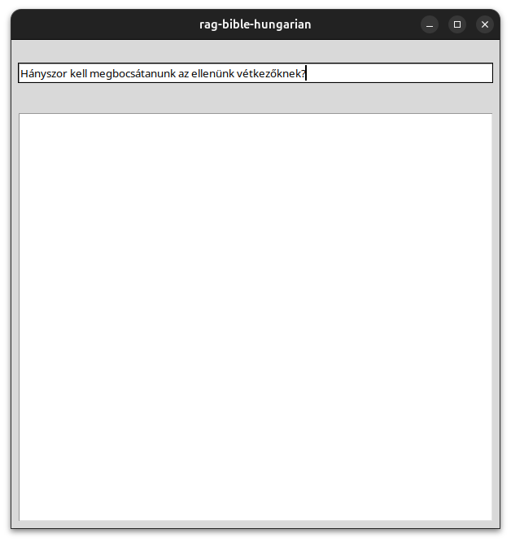
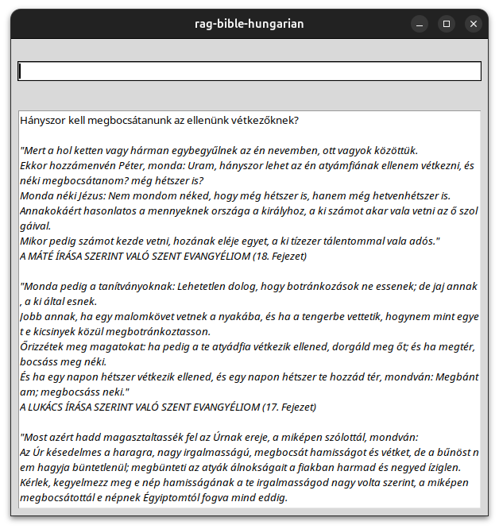
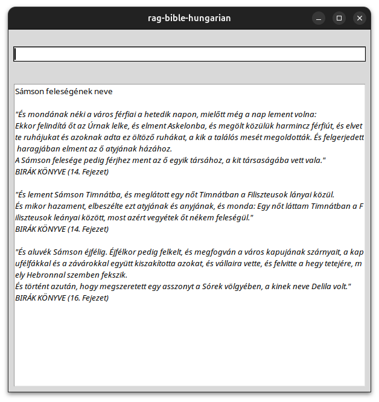
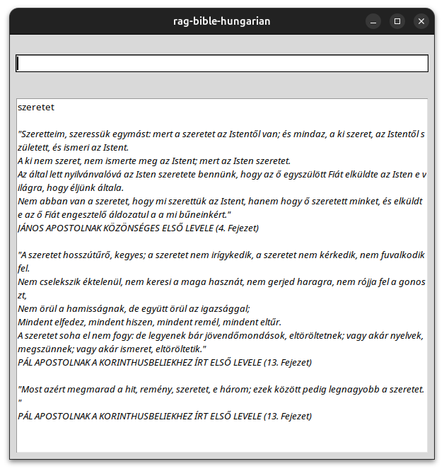

# rag-bible-hungarian
A RAG implementation for the Hungarian Bible

## Features
- Search for exact phrases in the Bible
- Search for specific information in the Bible
- Search for topics in the Bible

## Screenshots

| Demonstration Q                            | Demonstration A                            |
| ------------------------------------------ | ------------------------------------------ |
|  |  |


| Specific question                          | Topic question               |
| ------------------------------------------ | ---------------------------- |
|  |  |


## Usage

### Install dependencies
```
python3 -m venv .venv
source .venv/bin/activate
pip install -r requirements.txt
```

### Run
```
python3 src/main.py
```

## QA
#### Q: Why the Bible?
A: I needed something that contains a lot if information and is widely known

#### Q: Why in Hungarian?
A: I'm Hungarian and I wanted to show it to my wife. She prefers the Hungarian Bible.

#### Q: Is it really usable?
A: It's just a practice project for some online course. It might be fun and useful sometimes but the main goal is to present the logic behind it.

#### Q: Will there be an English version of it?
A: Maybe.

#### Q: Can I swap the source text to something else?
A: Absolutely, but it needs some code modification.